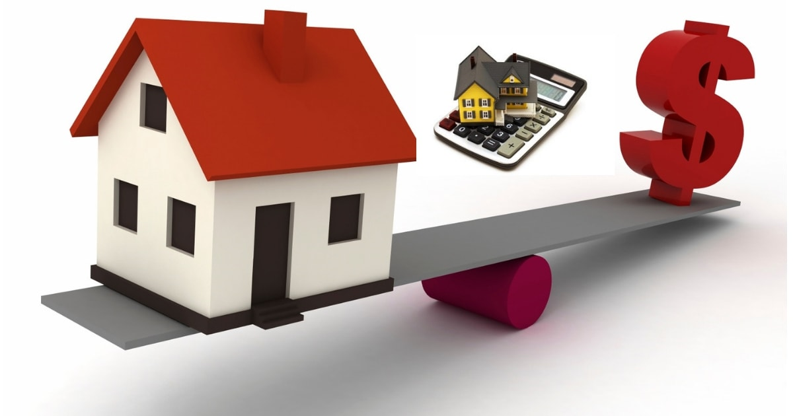

# **DQR – Data Quality Report**
*Portfólio Thiago Gonçalves Custódio*

---

## **Definição do Problema**

Uma empresa imobiliária americana precisa de um relatório que demonstre que os dados são confiáveis e coerentes e que a qualidade da informação que eles oferecem pode ser usada para modelos de previsão de fraudes e valor do imóvel. Sendo assim apresentaremos um **DQR – Data Quality Report**.

**Informações sobre o DataSet:** Para este projeto usaremos dados públicos da cidade de *New York*. Os dados podem ser baixados no portal de dados abertos da cidade [**NYC Open Data**](https://data.cityofnewyork.us/Housing-Development/Property-Valuation-and-Assessment-Data/rgy2-tti8).

A descrição do que representa cada variável pode ser obtida ao baixar o Dataset no portal [**NYC Open Data**](https://data.cityofnewyork.us/Housing-Development/Property-Valuation-and-Assessment-Data/rgy2-tti8) e de forma complementar no portal [**NYC Department of Finance**](https://www1.nyc.gov/site/finance/taxes/definitions-of-property-assessment-terms.page).

Para visualizar a análise completa feita neste projeto, acesse este link:

* https://th14g0cust0d10.github.io/Projeto_DQR_Python/

---
